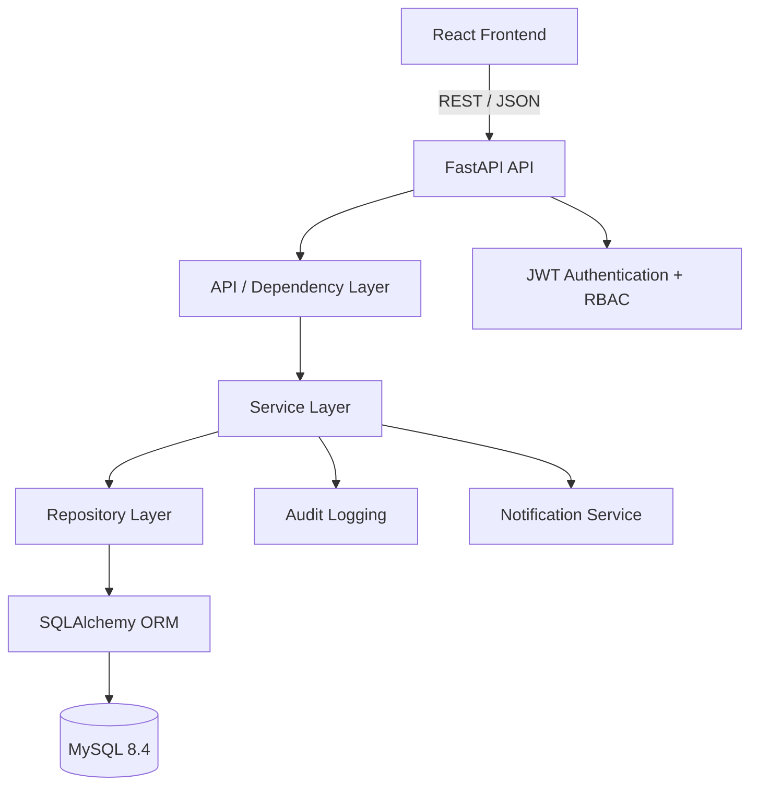

# Employee Management & HR Workflow System

A production-style full-stack employee management application built to demonstrate practical **Python/FastAPI backend engineering**, relational database design, authentication, authorization, testing, Docker and frontend integration.

> **Portfolio project:** designed and implemented as a realistic HR operations system rather than a basic CRUD demo.

## Live demo

**Status:** deployment-ready. A public URL is intentionally not committed because production credentials and infrastructure are environment-specific.

When deployed, place the frontend and API URLs here:

- **Web app:** `<YOUR_FRONTEND_URL>`
- **API:** `<YOUR_API_URL>`
- **Swagger UI:** `<YOUR_API_URL>/docs`

## What the project demonstrates

- REST API development with FastAPI
- Layered architecture: API → service → repository → SQLAlchemy ORM
- MySQL 8.4 and Alembic schema migrations
- JWT authentication with Argon2 password hashing
- Role-based access control (ADMIN, HR, HR_MANAGER, MANAGER, EMPLOYEE)
- Employee and department management
- Manager/direct-report relationships
- Attendance tracking with duplicate-date protection
- Leave requests, balance validation and manager/HR approval workflow
- Persistent in-app notifications with unread/read state
- Audit logging for important administrative operations
- Pagination, filtering and validation
- React frontend integrated with the REST API
- Docker Compose development environment
- CI pipeline for linting, backend tests and frontend builds

## Architecture



### Backend request flow

```text
HTTP Request
    ↓
FastAPI Router
    ↓
Authentication / Authorization
    ↓
Service Layer (business rules)
    ↓
Repository Layer (data access)
    ↓
SQLAlchemy
    ↓
MySQL
```

This separation keeps HTTP concerns, business rules and persistence logic independently testable and maintainable.

## Core workflows

### Leave approval

```text
Employee submits leave
        ↓
Balance + date-overlap validation
        ↓
PENDING
        ↓
Manager / HR reviews
        ↓
APPROVED or REJECTED
        ↓
Audit log + notification
```

### Access control

| Capability | ADMIN | HR | HR_MANAGER | MANAGER | EMPLOYEE |
|---|:---:|:---:|:---:|:---:|:---:|
| View own profile/data | ✓ | ✓ | ✓ | ✓ | ✓ |
| Manage employees | ✓ | ✓ | ✓ | — | — |
| Manage departments | ✓ | ✓ | ✓ | — | — |
| Manage roles | ✓ | — | — | — | — |
| Review direct-report leave | ✓ | ✓ | ✓ | ✓ | — |
| Submit own leave | ✓ | ✓ | ✓ | ✓ | ✓ |
| View audit logs | ✓ | ✓ | ✓ | — | — |

Server-side authorization is enforced independently of the frontend UI.

## Technology stack

### Backend

- Python 3.12
- FastAPI
- SQLAlchemy 2.x
- Pydantic v2 / pydantic-settings
- MySQL 8.4
- Alembic
- JWT (`python-jose`)
- Argon2 password hashing (`pwdlib`)
- Pytest + HTTPX

### Frontend

- React 19
- React Router
- Axios
- Vite
- Nginx for production-style static serving

### DevOps

- Docker / Docker Compose
- GitHub Actions
- Ruff

## Project structure

```text
.
├── app/
│   ├── api/
│   │   ├── deps.py
│   │   └── v1/
│   │       ├── auth.py
│   │       ├── employees.py
│   │       ├── departments.py
│   │       ├── attendance.py
│   │       ├── leaves.py
│   │       ├── leave_approval.py
│   │       ├── leave_balance.py
│   │       ├── notifications.py
│   │       ├── roles.py
│   │       ├── audit.py
│   │       └── router.py
│   ├── core/
│   │   ├── config.py
│   │   ├── security.py
│   │   ├── exceptions.py
│   │   └── logging.py
│   ├── db/
│   ├── middleware/
│   ├── models/
│   ├── repositories/
│   ├── schemas/
│   ├── services/
│   └── main.py
├── alembic/
│   └── versions/
├── src/
│   ├── components/
│   ├── pages/
│   └── services/
├── tests/
├── docs/
├── docker/
├── .github/workflows/ci.yml
├── Dockerfile
├── Dockerfile.frontend
├── docker-compose.yml
├── nginx.conf
├── requirements.txt
├── package.json
├── pyproject.toml
└── .env.example
```

## Running locally

### Option A — Docker Compose (recommended)

1. Copy `.env.example` to `.env`.
2. Change `SECRET_KEY` to a long random value.
3. Start the complete stack:

```powershell
docker compose up --build -d
```

4. Check services:

```powershell
docker compose ps
```

5. Open:

```text
Frontend: http://localhost:5174
API:      http://localhost:8000
Swagger:  http://localhost:8000/docs
Health:   http://localhost:8000/health
```

The API container runs `alembic upgrade head` and idempotently seeds the default roles before starting the server.

### Option B — Backend locally + MySQL in Docker

```powershell
docker compose up -d mysql
python -m venv .venv
.\.venv\Scripts\Activate.ps1
pip install -r requirements.txt
alembic upgrade head
python scripts/seed_roles.py
python create_admin.py --email admin@example.com
uvicorn app.main:app --reload
```

For the frontend:

```powershell
npm ci
npm run dev -- --host 0.0.0.0
```

## Demo data

The `employee-management-demo-data/` directory contains additive portfolio data for demonstrating employees, departments, attendance, leave states, notifications and audit history.

**Do not use the included demo credentials or data in production.**

## Testing

The test suite is intentionally independent of a developer's local MySQL installation. API smoke tests use SQLite through the test configuration, while the application itself remains configured for MySQL in normal environments.

```powershell
pip install -r requirements.txt
pytest
```

Run linting:

```powershell
pip install ruff
ruff check app tests scripts
```

Run the frontend build:

```powershell
npm ci
npm run build
```

CI runs all three checks automatically on pushes and pull requests.

## API documentation

FastAPI exposes interactive documentation at:

```text
http://localhost:8000/docs
```

The API is versioned under `/api/v1`.

Main resource groups:

- `/auth`
- `/employees`
- `/departments`
- `/attendance`
- `/leaves`
- `/roles`
- `/notifications`
- `/audit-logs`
- `/employees/{employee_id}/leave-balance`
- `/health`

## Security notes

- Passwords are hashed with Argon2; plaintext passwords are never persisted.
- JWT tokens are signed with a configurable secret.
- Protected operations use server-side role checks.
- Employee/manager access is restricted for sensitive workflows.
- Secrets are supplied through environment variables and `.env` is ignored by Git.
- Unexpected 500 responses do not expose internal exception details.
- CORS origins are configurable rather than hard-coded for production.

## Deployment

See [`docs/DEPLOYMENT.md`](docs/DEPLOYMENT.md) for a provider-neutral production deployment checklist and the values that must be configured before publishing a public demo.

## Engineering decisions

### Why FastAPI?

FastAPI provides typed request/response schemas, dependency injection, automatic OpenAPI documentation and strong support for building REST APIs quickly while keeping the codebase structured.

### Why a service/repository split?

The API layer handles HTTP concerns, the service layer owns business rules such as leave balances and approval rules, and repositories isolate database access. This reduces coupling and makes business logic easier to test.

### Why Alembic?

Database changes are version-controlled and reproducible. A new environment can reach the same schema by running `alembic upgrade head`.

## Future improvements

- Refresh-token/session management
- Background job processing for email notifications
- More granular permissions than role-only authorization
- Full integration tests against MySQL in CI
- Structured JSON logging and centralized observability
- Production secrets manager integration

## Portfolio note

This project is intentionally presented as a **production-style learning project**. It demonstrates architecture, security, validation, testing and deployment practices without claiming to be a certified enterprise HR product.

## License

MIT. See [`LICENSE`](LICENSE).
